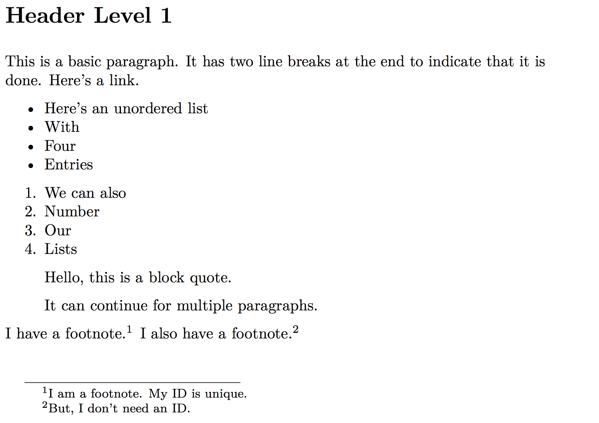

# Writing Made Plain

This tutorial page is designed to get you writing in Markdown,  exporting to MS Word, and fully automating the management of your citations.

Advantages of writing this way:

* Writing anywhere
    * Markdown is an open format that, at the end of the day, is just plain text. You can dictate on your phone and paste it into your MS without any formatting problems.
* Meaningful track changes on Dropbox or GitHub
    * Because Markdown is plain text, the changes tracked on your favorite offsite backup will track word-by-word edits.
* Automatically generate works cited and references
    * Including the ability to switch citation styles without reformatting!

## Agenda

1. What Software?
1. What is Markdown?
1. Installing Everything
1. Build Your Document
1. Advanced Pandoc
1. Advanced Project Organization

## Software We Will Be Using

1. **Atom** – An extensible, FOSS text editor that has excellent Pandoc support
1. **Pandoc** – A document converter that, amongst many other things, converts Markdown to MS Word, HTML, and PDF
1. **Zotero** – A reference management tool for organizing and collecting references
1. **Zotero Better BibTeX** – A Zotero plugin that automatically exports the plain text bibliography file used by Pandoc and Atom

## Markdown

~~~markdown
# Header Level 1

## Header Level 2

### etc.

This is a basic paragraph. It has two line breaks at the end to indicate that it is done. Here's a [link](http://google.com).

* Here's an unordered list
* With
* Four
* Entries

1. We can also
1. Number
1. Our
1. Lists

> Hello, this is a block quote.
>
> It can continue for multiple paragraphs.

I have a footnote.[^fn1] I have a footnote.[^fn1] I also have a footnote.^[But, I don't need an ID.]

[^fn1]: I am a footnote. My ID is unique.
~~~

Will produce (when converted to PDF by pandoc):

`pandoc -s -f markdown+smart -o sample.pdf sample.md`

## The Stack in Action

This is a much more complicated Markdown document:

~~~markdown
---
title: "Hello There"
bibliography: test.bib
csl: modern-language-association-7th-edition.csl
author:
  - Andrew Pilsch
---

Here's a citation [@lem_summa_2014, p. 24].

Here's another [@bratton_stack_2016, p. 243].

Here's a third [@colebrook_what_2016, p. 22].

> I'm a blockquote. [@bernal_world_2018, p. 147]

~~~

New elements:

* YAML metadata block
* Citations!

## Installation Overview

To setup our full writing Stack, we will need to:

1. Install a FOSS Package Manager
2. Install Git
3. Install Pandoc
4. Install CSL
5. Install Atom
6. Install Zotero
7. Install Zotero Better BibTeX

## Install a FOSS Package Manager

There is a world of command line, FOSS (Free and OpenSource Software) available, even for Windows. To make installing it easier, I ask you install a package manager: Home Brew for macOS, Scoop for Windows.

Need help with the command line? [Tracy Osborn's pamphlet is quite good](https://drive.google.com/file/d/1_2LTtR6f5bFCC5wjFZc9ILA7vmru7ShK/view?usp=sharing).

At a bare minimum, you should be able to move between directories (`cd`), list directory contents (`ls`), and create new directories (`mkdir`) for using pandoc.

### macOS

We're installing [Home Brew](https://brew.sh/), an FOSS installer for macOS.

Open Terminal (<kbd>⌘</kbd>+<kbd>Space</kbd>, then "Terminal" and <kbd>⏎</kbd> OR /Applications/Utilities and double-click "Terminal"). In Terminal, paste the following: `/usr/bin/ruby -e "$(curl -fsSL https://raw.githubusercontent.com/Homebrew/install/master/install)"` and press <kbd>⏎</kbd>.

### Windows

We're installing [scoop](https://scoop.sh/), an FOSS installer for Windows.

Open Powershell (<kbd>Win</kbd>+<kbd>R</kbd>, then "powershell" and <kbd>Enter</kbd>). In Powershell paste (right-click) the following: `iex (new-object net.webclient).downloadstring('https://get.scoop.sh')` and press <kbd>Enter</kbd>.

## Install Git

Git is the command line tool that powers GitHub. We will use it to download some repositories.

### Windows

In Powershell, run:

* `scoop install git`

### macOS

In Terminal, run:

* `brew install git`

## Install Pandoc (+ LaTeX for PDF)

For now, install Pandoc, if you're following along. I would suggest waiting to install LaTeX, as it is a very big download, especially for macOS.

Waiting to install LaTeX is fine, as it is only used to convert to PDFs in Pandoc.

### Windows

Run the following in Powershell:

* `scoop bucket add extras`
* `scoop install pandoc`

Later, for PDF support:

* `scoop install latex`

### macOS

Run the following in Terminal:

* `brew update`
* `brew install pandoc`

Later, for PDF support:

* `brew tap phinze/cask`
* `brew install brew-cask`
* `brew cask install mactex`

## Install CSL

CSL (Citation Style Language) is an XML grammar that describes citation systems, including in-text / note references and works cited pages. Pandoc uses CSL to format your references.

### Windows

In Powershell, run `git clone https://github.com/citation-style-language/styles "$env:appdata\csl"`

### macOS

In Terminal, run `git clone https://github.com/citation-style-language/styles $HOME/.csl`.

## Install Atom

Technically you could use any text editor (even Notepad on Windows or Speech-to-text on your phone) to edit your Markdown documents, but I like Atom and it has some great support.

Download the installer from [https://atom.io/](https://atom.io/). There is one more step for Windows.

### Windows Additional Step

open Powershell (<kbd>Win+R</kbd>, type "powershell", and press <kbd>Enter</kbd>). Copy the following command and paste it into the shell (you paste into Command Line by right clicking): `$env:path += ";$env:localappdata\atom\bin"`. This will add the commands `apm` (for install Atom packages) and `atom` (for launching the editor from the command line) to your path. After testing that those commands work, run `[Environment]::SetEnvironmentVariable("Path", $env:Path)` to finalize your changes for future sessions.

### Install and Configure Packages

On your command line (Powershell for Windows; Terminal for macOS), copy and paste the following line: `apm install markdown-preview-plus markdown-writer language-pfm autocomplete-bibtex`. Press <kbd>⏎</kbd>.

When that finishes, go back to Atom. Bring up the command palette (<kbd>⌘</kbd>+<kbd>⇧</kbd>+<kbd>P</kbd>) and type "installed". Choose "Setting View: View Installed Packages" from the dropdown and press <kbd>⏎</kbd>. In the "Installed Packages" tab that opens, search for "gfm" and find the package **"language-gfm"** in the results. Click the "Disable" button in that result card.

You may need to restart Atom at this point.

## Install Zotero

### Windows and macOS

Download [Zotero](https://www.zotero.org/) at [https://www.zotero.org/download/](https://www.zotero.org/download/). Run the installer and install as you would normally.

### Install Zotero Better BibTeX

Visit [https://github.com/retorquere/zotero-better-bibtex/releases/latest](https://github.com/retorquere/zotero-better-bibtex/releases/latest) and click the link to a `.xpi` file.

When that download finishes, open Zotero and:

1. In the main menu go to Tools > Add-ons
1. Select 'Extensions'
1. Click on the gear in the top-right corner and choose 'Install Add-on From File...'
1. Choose .xpi that you've just downloaded, click 'Install'
Restart Zotero

## Configuring Zotero Better BibTeX and autocomplete-bibtex

In Zotero, right click on "My Library" and choose "Export Library ..." from the drop-down menu. From the "Format" dropdown menu, choose "Better BibLaTeX" and check the box next to "Keep updated". Save the file someplace permanent, "Documents" on macOS or "My Documents" on Windows,  and name it whatever you like.

In Atom, bring up the command palette (<kbd>⌘</kbd>+<kbd>⇧</kbd>+<kbd>P</kbd>) and type "installed". Choose "Setting View: View Installed Packages" from the dropdown and press <kbd>⏎</kbd>. In the "Installed Packages" tab that opens, search for "autocomplete" and find the package **"autocomplete-bibtex"** in the results. Click the "Settings" button in that result card.

Under the "Settings" heading, find the input field labelled "Bibtex". Type the file path for your exported library. For instance, if you saved it to "Documents" on macOS, type "~/Documents/My Library.bib" (assuming you didn't rename the file).

Now, open a Markdown document and start typing a citation key ("@" + whatever); the pop-up menu will let you select the citation from your Zotero library to add to your document.

If you haven't added anything to Zotero yet, add something to your library. To make this easy, you will want to install "Zotero Connector" for your favorite web browser. This will let you push a button in the browser to import citations into your library. Visit [https://www.zotero.org/download/](https://www.zotero.org/download/) and install it. 

As you add citations to your library, Zotero Better BibTeX will automatically export these new citations to the .bib file we just showed to our plugin. This happens because we remembered to check the "Keep updated" box when we were exporting a minute ago.

The only thing you have to remember is that Zotero has to be open when you want to import citations from the browser. Otherwise, everything should just work!

## Build a Document

We are now ready to start editing our document in Atom. When it is time to compile it, we can run something like:

`pandoc --filter=pandoc-citeproc -s -f markdown+smart -o test.pdf test.md`

To get different outputs, change the file extension on the -o switch (so, to .docx).

**Note**: Unlike most of what we've done today, you have to run pandoc in the same directory as your Markdown files. Use the `cd` command (and remember that hitting the tab key will cause your command line to autocomplete file names for you) to change into the same directory as your files. Also remember when `cd`ing, that if your file path (which is the sequence of slashes (or backslashes) and folder names that makes up the entire route from the current directory to the desired one) has spaces in it, you can put a `\` in front of the space to escape it or you can surround the whole file path in quotation marks (`"`).

## What Else Can We Do With Pandoc?

### Change Citations at the Drop of a Hat!

So, your MS is now in chicago with endnotes. No problem. Browse or search the [Citation Style Language GitHub repo](https://github.com/citation-style-language/styles) to find the one you want.

In this case, the one we want is "chicago-fullnote-bibliography-with-ibid.csl". We can change our citations by changing the YAML front matter `csl` key to the new file. Then we recompile our document.

That's it!

### Import Track Changes into Markdown

Reviewer #2 got you down? You can import track changes comments into a markdown document using the following:

`pandoc --track-changes=all -f markdown+smart test.docx -o test-draft.md`

**Very Important**: This document will not have citation information, so *do not* output to the original manuscript file. Create a new draft file.

## How Would I Use this to Write a Book?

I'm glad you asked that! Though this is outside the scoop of this tutorial, I have created a GitHub repo for organizing and writing books using Pandoc Markdown. The repo is at: [https://github.com/oncomouse/rake-and-pandoc](https://github.com/oncomouse/rake-and-pandoc)

You will need to install the Ruby programming language and a few tools in order to get started.

### Installing for Windows

Open Powershell again and run `scoop install ruby`.

### Installing for macOS 

Open Terminal again and run `brew install ruby`.

### Downloading the Repo

In your command line, `cd` to where you would like to start your book. Run `git clone https://github.com/oncomouse/rake-and-pandoc` to clone the repo. You can rename that repo by running `mv rake-and-pandoc "My Awesome Book"` (with "My Awesome Book" (but not the quotes) replaced with your awesome book title).

Also, to clear out my repo's GitHub URL (and to eventually start your own), run `git remote rm origin`.

### Configuring Ruby

In your command line (either Powershell or Terminal) `cd` into the directory you just created (either `cd rake-and-pandoc` or `cd "Whatever Your Book is Called"`). Run `gem install bundler`. Next, run `bundle install`.

Read the `Readme.md` file for more information on how to use `rake` (which we just installed) to build parts or all of your MS.

## Further Reading

* ["A Plain Text Workflow for Academic Writing with Atom"](http://u.arizona.edu/~selisker/post/workflow/)
* ["Sustainable Authorship in Plain Text using Pandoc and Markdown"](https://programminghistorian.org/en/lessons/sustainable-authorship-in-plain-text-using-pandoc-and-markdown)
* [*The Plain Person’s Guide to Plain Text Social Science*](http://plain-text.co/)

Happy Writing!